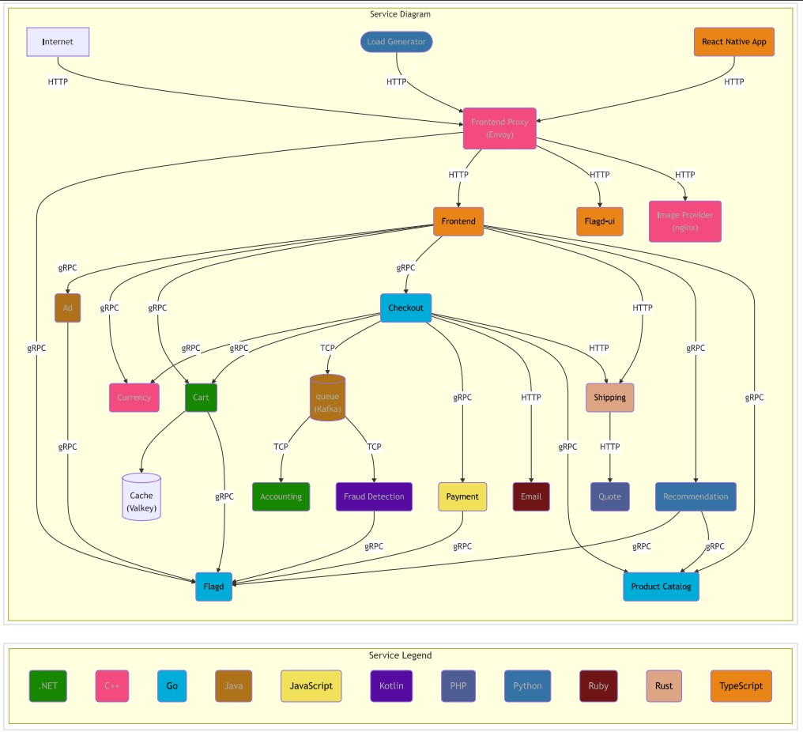

# DevOps E-Commerce Microservices on AWS EKS

A cloud-native, production-grade e-commerce application demonstrating end-to-end DevOps practices, microservices architecture, and scalable deployment on AWS EKS. This portfolio project showcases CI/CD automation, Kubernetes orchestration, multi-language services, and cloud infrastructure management.

---

## Table of Contents
- [Project Overview](#project-overview)
- [Architecture](#architecture)
- [Tech Stack](#tech-stack)
- [Features](#features)
- [CI/CD Pipeline](#cicd-pipeline)
- [Kubernetes Deployment](#kubernetes-deployment)
- [Local Development](#local-development)
- [Cloud Deployment (AWS EKS)](#cloud-deployment-aws-eks)
- [Contributing](#contributing)
- [License](#license)

---

## Project Overview
This project is a full-featured e-commerce platform built with a microservices architecture. Each service is containerized and orchestrated using Kubernetes, with automated CI/CD pipelines for build, test, and deployment. The solution is designed for reliability, scalability, and maintainability in cloud environments.

## Architecture
- **Microservices**: Product Catalog, Cart, Checkout, Payment, Currency, Email, Recommendation, Fraud Detection, Shipping, Frontend, Frontend Proxy, Load Generator, Kafka, Valkey, etc.
- **Languages**: Go, Java, C#, Python, C++, Node.js, Ruby, Rust
- **Communication**: REST, gRPC, Kafka
- **Infrastructure**: Docker, Kubernetes, AWS EKS, Terraform



## Tech Stack
- **Cloud**: AWS EKS, Terraform
- **Containerization**: Docker, Docker Compose
- **Orchestration**: Kubernetes (manifests in `kubernetes/`)
- **CI/CD**: GitHub Actions (`.github/workflows/`), Makefile
- **Languages**: Go, Java, C#, Python, C++, Node.js, Ruby, Rust


## Features
- Modular microservices for core e-commerce functions
- Automated build, test, lint, and Docker image publishing
- Dynamic Kubernetes manifest updates and deployments
- Infrastructure-as-Code with Terraform
- Multi-language service integration
- Scalable, cloud-ready architecture

## CI/CD Pipeline
- **Build & Test**: Automated via GitHub Actions for each service
- **Linting**: GolangCI-Lint, ESLint, etc.
- **Docker Image Build & Push**: Secure publishing to Docker Hub
- **Kubernetes Manifest Update**: Automated image tag updates and deployment
- **Infrastructure Provisioning**: Terraform for AWS EKS

## Kubernetes Deployment
- All manifests located in `kubernetes/`
- Service-specific deployments, accounts, and configs
- Automated updates via CI/CD
- Example command:
  ```sh
  kubectl apply -f kubernetes/complete-deploy.yaml
  ```

## Local Development
- Clone the repo:
  ```sh
  git clone <repo-url>
  cd <repo-folder>
  ```
- Build and run with Docker Compose:
  ```sh
  docker compose up -d
  ```
- Service-specific instructions in each `src/<service>/README.md`

## Cloud Deployment (AWS EKS)
- Provision EKS cluster using Terraform modules: [deploy-aws-eks-cluster-using-terraform-modules](https://github.com/richards-okiemute/deploy-aws-eks-cluster-using-terraform-modules)
- Deploy manifests with `kubectl`
- CI/CD automates image publishing and manifest updates

## Contributing
Open to improvements and feedback. Please fork and submit pull requests for enhancements, bug fixes, or documentation updates.

## License
This project is licensed under the Apache 2.0 License.
